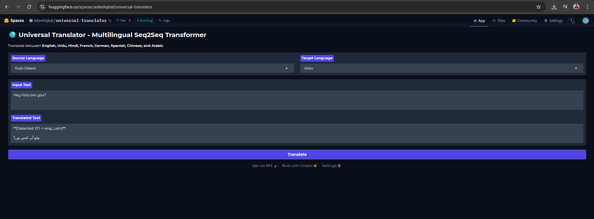

# 🌐 Universal Translator - Multilingual Seq2Seq Transformer

[](https://www.python.org/)
[](https://huggingface.co/transformers/)
[](https://gradio.app/)
[](https://huggingface.co/spaces/adeeliqbal/universal-translator)

---

## ✨ Overview

A Neural Machine Translation system leveraging Meta AI's pretrained **NLLB-200** model for direct many-to-many translation across multiple languages. Features automatic language detection and an interactive Gradio web interface.

### 🎯 Key Features

- **🌍 Multi-Language Support**: 8 languages in UI (English, Urdu, Hindi, French, German, Spanish, Chinese, Arabic)
- **🧠 Auto-Detection**: Automatically identifies source language using `langdetect`
- **⚡ Fast Inference**: Uses distilled `nllb-200-distilled-600M` (600M parameters)
- **🎨 Simple Interface**: Clean Gradio UI for easy translation
- **🔄 Direct Translation**: Many-to-many translation without English as pivot

---

## 🚀 Live Demo

Try the translator now: **[Universal Translator on Hugging Face Spaces](https://huggingface.co/spaces/adeeliqbal/universal-translator)**



---

## 🏗️ Technical Architecture

The system implements a modular Seq2Seq pipeline:

```
┌─────────────┐     ┌──────────────────┐     ┌─────────────────┐     ┌────────────┐
│ User Input  │ --> │ Language Detect  │ --> │ NLLB Transformer│ --> │   Output   │
│  (Gradio)   │     │   + ISO Mapping  │     │  (Encoder-Dec)  │     │ (Gradio)   │
└─────────────┘     └──────────────────┘     └─────────────────┘     └────────────┘
```

### Pipeline Stages

1. **Input Layer**: Captures raw text via Gradio interface
2. **Preprocessing & Detection**:
   - Text normalization (whitespace removal)
   - `langdetect` identifies ISO language code (e.g., `'ur'` for Urdu)
   - Maps ISO code → NLLB token (e.g., `'ur'` → `'urd_Arab'`)
3. **Inference Engine**:
   - NLLB-200 Transformer (Encoder-Decoder architecture)
   - Forced BOS tokens guide generation to target language
4. **Output Layer**: Returns decoded translation to UI

---

## 📂 Project Structure

```bash
machine-translation-transformer/
├── app.py                      # Main Gradio application
├── machine_translation.ipynb   # Jupyter notebook with experiments
├── requirements.txt            # Python dependencies
├── README.md                   # Project documentation
└── assets/
    └── preview1.png           # UI screenshot
```

---

## 🛠️ Installation & Setup

### Prerequisites

- Python 3.8 or higher
- pip (Python Package Manager)
- 4GB+ RAM recommended

### Quick Start

1. **Clone the Repository**

```bash
git clone https://github.com/adeel-iqbal/machine-translation-transformer.git
cd machine-translation-transformer
```

2. **Install Dependencies**

```bash
pip install -r requirements.txt
```

3. **Run the Application**

```bash
python app.py
```

4. **Access the Interface**

Open your browser and navigate to: `http://127.0.0.1:7860`

---

## 🧠 Model Details

| Component | Specification |
|-----------|---------------|
| **Architecture** | Transformer (Sequence-to-Sequence) |
| **Checkpoint** | `facebook/nllb-200-distilled-600M` |
| **Parameters** | 600 Million |
| **Vocabulary** | 256k tokens (SentencePiece) |
| **Training Data** | FLORES-200 Dataset |
| **Languages** | 200+ (including low-resource) |

### Supported Languages (Sample)

- **English** (`eng_Latn`)
- **Urdu** (`urd_Arab`)
- **Hindi** (`hin_Deva`)
- **French** (`fra_Latn`)
- **German** (`deu_Latn`)
- **Spanish** (`spa_Latn`)
- **Chinese** (`zho_Hans`)
- **Arabic** (`ara_Arab`)

[View all supported languages in NLLB documentation](https://github.com/facebookresearch/fairseq/tree/nllb)

---

## 📊 Performance & Limitations

### ✅ Strengths

- **Speed**: CPU inference completes in <2 seconds for typical sentences
- **Quality**: High BLEU scores on FLORES-200 benchmark
- **Flexibility**: Direct translation between any language pair

### ⚠️ Known Limitations

- **Context Length**: Optimized for sentence/paragraph-level translation (≤512 tokens)
- **Auto-Detection**: May struggle with very short text (1-2 words) or code-mixed sentences
- **Domain**: General-purpose model; may need fine-tuning for specialized domains (medical, legal)

---

## 🧪 Usage Example

```python
from transformers import AutoTokenizer, AutoModelForSeq2SeqLM, pipeline

# Load model
checkpoint = "facebook/nllb-200-distilled-600M"
tokenizer = AutoTokenizer.from_pretrained(checkpoint)
model = AutoModelForSeq2SeqLM.from_pretrained(checkpoint)

# Create translator
translator = pipeline("translation", model=model, tokenizer=tokenizer, max_length=400)

# Translate (Urdu to English)
translator.model.config.forced_bos_token_id = tokenizer.convert_tokens_to_ids("eng_Latn")
output = translator("یہ ایک ٹیسٹ ہے", src_lang="urd_Arab", tgt_lang="eng_Latn")
print(output[0]['translation_text'])  # Output: "This is a test"
```
---

## 📚 Citation & Acknowledgements

If you use this project in your research, please cite the original NLLB paper:

```bibtex
@article{nllb2022,
  author  = {NLLB Team, Meta AI},
  title   = {No Language Left Behind: Scaling Human-Centered Machine Translation},
  year    = {2022},
  journal = {arXiv preprint arXiv:2207.04672}
}
```

### Built With

- [Hugging Face Transformers](https://huggingface.co/transformers/) - Model implementation
- [Gradio](https://gradio.app/) - User interface framework
- [langdetect](https://github.com/Mimino666/langdetect) - Language detection
- [Meta AI NLLB](https://ai.facebook.com/research/no-language-left-behind/) - Core translation model

---

## 👨‍💻 Author

**Adeel Iqbal**

- GitHub: [@adeel-iqbal](https://github.com/adeel-iqbal)
- LinkedIn: [adeeliqbalmemon](https://linkedin.com/in/adeeliqbalmemon)
- Email: adeelmemon096@yahoo.com

---

## 🌟 Show Your Support

If you find this project helpful, please consider giving it a ⭐ on GitHub!

---

<p align="center">
  <i>Breaking language barriers, one translation at a time.</i>
</p>

<p align="center">
  Made with ❤️ by <a href="https://github.com/adeel-iqbal">Adeel Iqbal</a>
</p>
